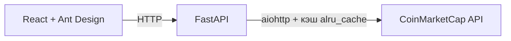

# PythonCripto

Веб-приложение для просмотра актуальных данных о криптовалютах: список монет слева, карточка с ценой, изменением за 24 часа и капитализацией справа. Данные берутся из [CoinMarketCap API](https://coinmarketcap.com/api/), бэкенд кэширует ответы, фронтенд отображает выбранную монету.

## Стек

| Часть | Технологии |
|--------|------------|
| **Backend** | Python, FastAPI, aiohttp, async-lru, pydantic-settings |
| **Frontend** | React 19, Vite, Ant Design, Tailwind CSS, Axios |
| **API** | CoinMarketCap Pro API |

## Структура репозитория

```
PythonCripto/
├── PythonCriptoBack/src/     # FastAPI: роуты, HTTP-клиент CMC, настройки
├── pythonCriptoFront/        # React SPA (Vite)
├── requirements.txt          # зависимости Python
├── .env.example              # шаблон переменных окружения
└── README.md
```

## Быстрый старт

### Требования

- Python 3.10+
- Node.js 18+
- API-ключ CoinMarketCap (бесплатный тариф на [сайте API](https://coinmarketcap.com/api/))

### 1. Клонирование и переменные окружения

```bash
git clone <url-вашего-репозитория>
cd PythonCripto
copy .env.example .env
```

В `.env` укажите свой ключ:

```env
CMC_API_KEY=ваш_ключ
```

Файл `.env` в git не попадает (см. `.gitignore`).

### 2. Backend

Из корня репозитория:

```bash
python -m venv .venv
.venv\Scripts\activate
pip install -r requirements.txt
uvicorn PythonCriptoBack.src.main:app --reload --host 127.0.0.1 --port 8000
```

Документация API: [http://127.0.0.1:8000/docs](http://127.0.0.1:8000/docs)

### 3. Frontend

В отдельном терминале:

```bash
cd pythonCriptoFront
npm install
npm run dev
```

Откройте адрес, который выведет Vite (обычно [http://localhost:5173](http://localhost:5173)).

> Бэкенд должен быть запущен на `http://127.0.0.1:8000` — фронтенд обращается к нему напрямую.

## API (бэкенд)

| Метод | Путь | Описание |
|--------|------|----------|
| `GET` | `/cryptocurrencies` | Список криптовалют (listings/latest) |
| `GET` | `/cryptocurrencies/{currency_id}` | Котировки по `id` монеты |

## Как это устроено



1. При загрузке страницы фронтенд запрашивает список монет и строит боковое меню.
2. При выборе монеты — запрос деталей по `id`.
3. Бэкенд проксирует запросы в CMC с заголовком `X-CMC_PRO_API_KEY` и кэширует ответы (`@alru_cache`).

## Плюсы проекта (+)

- **Полный цикл**: отдельный бэкенд и фронтенд — хорошая база для портфолио и дальнейшего роста.
- **Актуальные технологии**: FastAPI, async HTTP, React 19, Vite, современный UI (Ant Design + Tailwind).
- **Реальный внешний API**: работа с ключами, `.env`, CORS, лимитами стороннего сервиса.
- **Кэш на бэкенде**: меньше обращений к CoinMarketCap при повторных запросах.
- **Понятный UX**: список слева, детали справа, индикатор загрузки (`Spin`).
- **Небольшой объём кода**: легко разобрать и расширить за вечер.

## Минусы и ограничения (−)

- **Жёстко зашитый URL API** на фронте (`127.0.0.1:8000`) — без переменных окружения сложно деплоить.
- **Запуск бэкенда из корня** — нужен корректный `PYTHONPATH`/запуск как пакет; новичкам проще положить `app` в один модуль или добавить `pyproject.toml`.
- **Кэш без TTL**: `@alru_cache` не обновляет цены по времени — для «живого» трекера нужен TTL или Redis.
- **Одна сессия aiohttp на всё приложение**: при перезапуске/ошибках нет явного lifecycle (startup/shutdown).
- **Нет обработки ошибок API** на фронте и бэкенде (истёк ключ, 429, сеть).
- **Нет тестов и CI** — сложнее гарантировать регрессии при изменениях.
- **Мелкие недочёты UI/данных**: в карточке для «изменения за 24ч» используется `volume_change_24h`, а не `percent_change_24h`; у капитализации в тексте лишний символ `%`.
- **Только USD** — нет выбора валюты отображения.

## Идеи: что реализовать дальше

Ниже — проекты и фичи по возрастанию сложности; многие логично нарастают на этом репозитории.

### На базе текущего кода

1. **График цены** — Chart.js / Recharts + исторические свечи (CMC historical endpoints или бесплатный CoinGecko).
2. **Поиск и фильтры** — по имени, топ-10/50/100, сортировка по капитализации или изменению %.
3. **Избранное (watchlist)** — localStorage или SQLite/PostgreSQL на бэкенде.
4. **Алерты** — уведомление, когда BTC пересёк порог (фоновая задача + Telegram bot).
5. **Docker Compose** — один `docker compose up` для API + фронта + `.env`.
6. **Деплой** — бэкенд на Render/Fly.io, фронт на Vercel/Netlify, CORS и `VITE_API_URL`.

### Отдельные небольшие проекты (портфолио)

7. **Крипто-портфель** — вводишь покупки (монета, кол-во, цена), считаешь P&L и долю в портфеле.
8. **Конвертер валют** — BTC ↔ ETH ↔ USD без полного дашборда.
9. **Новостная лента** — агрегатор заголовков (CryptoPanic, RSS) с тегами по монетам.
10. **Сравнение бирж** — спред цены одной пары на Binance / Bybit / OKX (публичные REST).
11. **Telegram-бот** — `/price BTC`, `/top 10` через тот же FastAPI или aiogram.
12. **Paper trading** — виртуальный баланс и «сделки» по текущим ценам без реальных денег.

### Более серьёзный уровень

13. **WebSocket-стрим** — live-цены через Binance WS + React без постоянного polling.
14. **Бэктест стратегии** — SMA crossover на исторических CSV (pandas + matplotlib).
15. **Дашборд DeFi** — TVL протоколов (DefiLlama API).
16. **Авторизация** — JWT, личный watchlist в БД, rate limit по пользователю.

## Лицензия

Укажите лицензию при публикации (например, MIT), если репозиторий открытый.

## Автор

Ваше имя / ссылки на GitHub, Telegram — по желанию.
